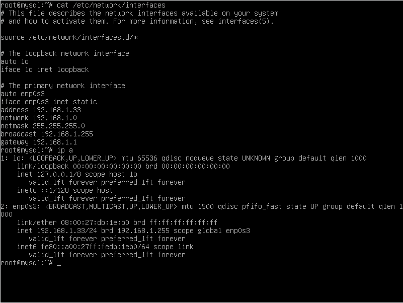
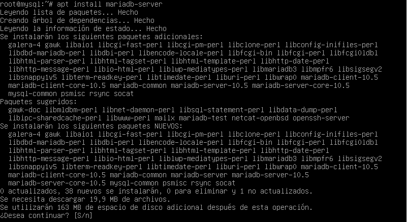
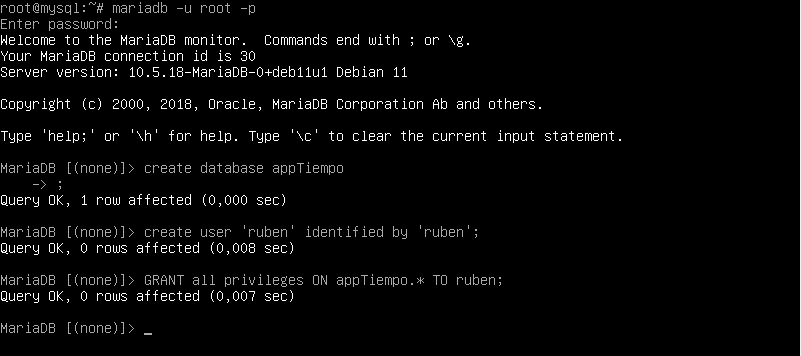
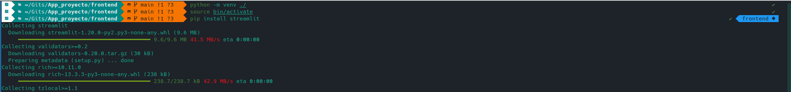
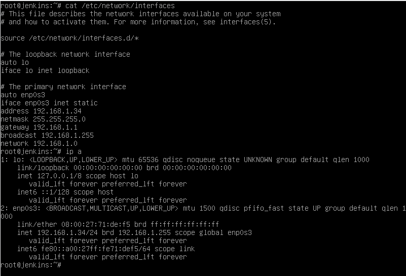
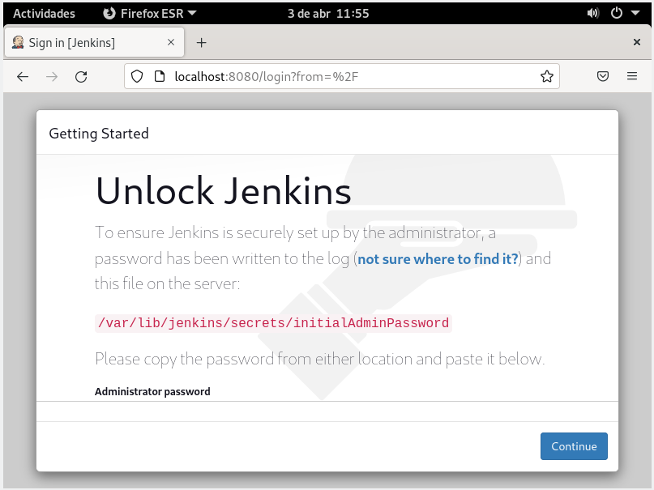
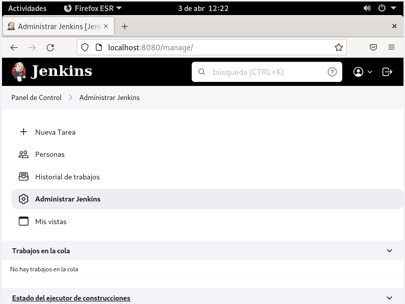

# App proyecto

# Índice

1. [Propósito de este proyecto.](#Propósito)
2. [Herramientas.](#Herramientas)
3. [Creación del entorno.](#Creación del entorno)
4. [Desarrollo de la app.]()

# Propósito

Este es el proyecto que he realizado para la finalización del Grado Superior de Administración en Sistermas Informáticos en Red.
Consiste en el desarrollo de una app con Python para la recogida automática de datos de una estación meteorológica y el análisis los mismos para realizar previsiones futuras. El desarrollo de la app, estará sometido a los principios
de la integración continua utilizando las herraminetas necesarias para ello.
Por otro lado, esta app estará conformada por un backend y un frontend. El backend se compone de una aplicación de recogida de datos, una aplicación de análisis de datos, una base de datos y una api rest. Esta última, servirá para
establecer la comunicación entre el backend y el frontend, el cual mostrará a través de la web los análisis realizados de los datos.

# Herramientas

Python: lenguaje de programación utilizado para el desarrollo de la app.
BeautifulSoup: librería de Python que me permitirá realizar web scrapping y así obtener los datos que me interesen de la estación meteorológica y almacenarlos en mi servidor de base de datos.
Pandas: librería de Python para el anaĺsiis de los datos almacenados. Una vez analizados serán almcenados en una base de datos distinta.
Flask: framework de Python para el desarrollo de Api Rest.
Streamlit: librería de Python para desarrollo web (lo utilizaré para crear el Frontend).
Jenkins: programa para la automatización de todo el desarrolo de una app.
MariaDB: servidor de base de datos.
Virtualbox: progrmama para virtualización que utlizaré para crear un servidor de base de datos y un servidor de Jenkins.
Docker: programa de creación de contenedores que me permitirá separar el forntend y el backend, para facilitarme el desarrollo de los mismos y mejorar su rendimiento.

# Creación del entorno

## Servidor de Base de Datos

Con virutalbox crearé una máquina con Debian sin entorno gráfico. Posteriormente, instalaré en ella MariaDB y crearé un usuario con permisos sobre la base de datos y sus tablas.

## Entorno virtual

Para el desarrollo de la aplicación me ayudaré de los entornos vituales de Python, utilizaré uno para el desarrollo del backend y otro para el del frontned. De esta manera, tendré ambos desarrollos apartados y me permitirá
crear contenedores más livianos, ya que, solo se instalarán las librerías necesarias para cada uno.

### Backend

Una vez creado el entorno virtual he de instalar las dependencias necesarias para el backend. Para ello debo activar el entorno virtual con ``source bin/activate`` esto en el caso de Linux. En el caso de linux, en windows es
``Scripts/activate``.

Una vez activado es hora de instalar los módulos necesarios, para ello nos valdremos de la herramienta pip.

Para dejar de usar un entorno virtual de python se usa ``deactivate``

### Frontend

## Jenkins

Para usar jenkins, lo instalaré en otra máquina virtual Debian sin entorno gráfico.

### Instalación de Jenkins

He seguido los pasos proporiconados por la web de Jenkins.

Luego de insertar los repositorios de jenkins, debemos ejecutar los siguientes comandos:

``apt update``

``apt install fontconfig openjdk-17-jdk``

`` apt install jenkins``

Una vez instalado el paquete, desde el navegador, deberemos terminar de instalar. Para acceder por el navegador debemos introducir la dirección siguiente ``http://ip_delservidor:8080``.

Aparecerá una iamgen como esta:

Deberemos introducir la contraseña que viene por defecto en la ruta indicada, una vez hecho, nos preguntará que opción instalar, escogemos la opción de plugins recomendados.

Para terminar, nos dejará crearnos un usuario administrador para jenkins. Una vez creado, ya habrá finalizado la instalación de Jenkins.

En esta misma máquina es necesario instalar docker para facilitar la automatización de la compilación de la aplicación en una imagen docker.

``apt install docker.io``
