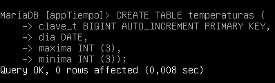
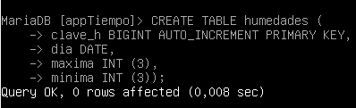
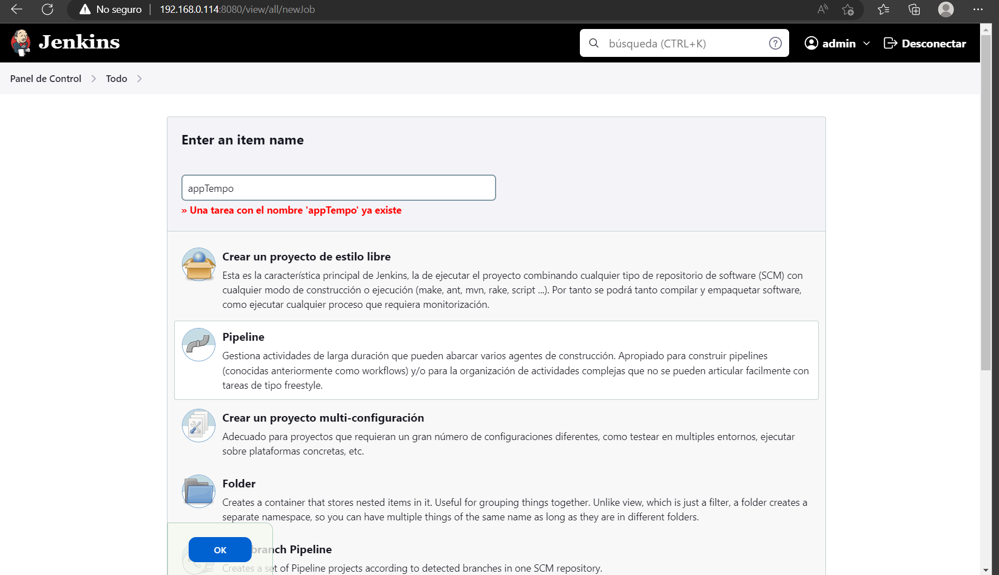
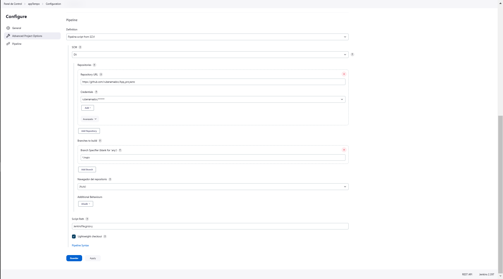
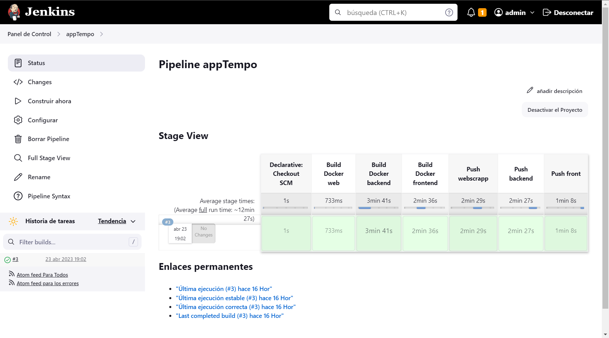

# appTempo

# Índice

1. [Propósito de este proyecto.](#Propósito)
2. [Herramientas.](#Herramientas)
3. [Creación del entorno.](#Entorno)
4. [Desarrollo de la app.](#Desarrollo)
5. [Integración](#Integración)

# Propósito

Este es el proyecto que he realizado para la finalización del Grado Superior de Administración en Sistermas Informáticos en Red.
Consiste en el desarrollo de una app con Python para la recogida automática de datos de AEMET y el análisis los mismos para realizar previsiones futuras. El desarrollo de la app, estará sometido a los principios
de la integración continua utilizando las herraminetas necesarias para ello.
Por otro lado, esta app estará conformada por un backend y un frontend. El backend se compone de una aplicación de recogida de datos, una aplicación de análisis de datos, una base de datos y una api rest. Esta última, servirá para
establecer la comunicación entre el backend y el frontend, el cual mostrará a través de la web los análisis realizados de los datos.

# Herramientas

Python: lenguaje de programación utilizado para el desarrollo de la app.

BeautifulSoup: librería de Python que me permitirá realizar web scrapping y así obtener los datos que me interesen de AEMET y almacenarlos en mi servidor de base de datos.

Pandas: librería de Python para el anaĺsiis de los datos almacenados.

Flask: framework de Python para el desarrollo de Api Rest.

Streamlit: librería de Python para desarrollo web (lo utilizaré para crear el Frontend).

Jenkins: programa para la automatización de todo el desarrolo de una app.

MariaDB: servidor de base de datos.

Virtualbox: progrmama para virtualización que utlizaré para crear un servidor de Jenkins.

Docker: programa de creación de contenedores que me permitirá separar el forntend y el backend, para facilitarme el desarrollo de los mismos y mejorar su rendimiento.

# Entorno

## Servidor de Base de Datos

Con Docker crearé un contenedor con mariadb. Posteriormente, crearé un usuario con permisos sobre la base de datos y sus tablas.

``docker run -d --name bd_app -p 3306:3306 -v C:\Users\RubénAmadoCardenas\appTiempo\database:/var/lib/mysql mariadb -e MARIADB_ROOT_PASSWORD=root mariadb``

## Entorno virtual

Para el desarrollo de la aplicación me ayudaré de los entornos vituales de Python, utilizaré uno para el desarrollo del backend y otro para el del frontned. De esta manera, tendré ambos desarrollos apartados y me permitirá
crear contenedores más livianos, ya que, solo se instalarán las librerías necesarias para cada uno.

### Backend

Una vez creado el entorno virtual he de instalar las dependencias necesarias para el backend. Para ello debo activar el entorno virtual con ``source bin/activate`` esto en el caso de Linux. En el caso de linux, en windows es
``Scripts/activate``.

Una vez activado es hora de instalar los módulos necesarios, para ello nos valdremos de la herramienta pip.

Para dejar de usar un entorno virtual de python se usa ``deactivate``

### Frontend

## Jenkins

Para usar jenkins, lo instalaré en otra máquina virtual Debian sin entorno gráfico.

### Instalación de Jenkins

He seguido los pasos proporiconados por la web de Jenkins.

Luego de insertar los repositorios de jenkins, debemos ejecutar los siguientes comandos:

``apt update``

``apt install fontconfig openjdk-17-jdk``

`` apt install jenkins``

Una vez instalado el paquete, desde el navegador, deberemos terminar de instalar. Para acceder por el navegador debemos introducir la dirección siguiente ``http://ip_delservidor:8080``.

Aparecerá una imagen como esta:

Deberemos introducir la contraseña que viene por defecto en la ruta indicada, una vez hecho, nos preguntará que opción instalar, escogemos la opción de plugins recomendados.

Para terminar, nos dejará crearnos un usuario administrador para jenkins. Una vez creado, ya habrá finalizado la instalación de Jenkins.

En esta misma máquina es necesario instalar docker para facilitar la automatización de la compilación de la aplicación en una imagen docker.

``apt install docker.io``

# Desarrollo

Antes de comenzar con el desarrollo de la aplicación, voy a crear las tablas en la base de datos. Estas tablas serán útiles para almacenar los datos brutos obtenidos de la fuente de información.

- Precipitaciones

- Temperaturas

- Humedad relativa

## Backend

El backend estará conformado por un microservicio de obtención de datos, uno de análisis de datos que funcionará a su vez como una api rest para comunicarse con el frontend y el servidor de bases de datos.

### Obtención de datos

Se encargará de obtener los datos de los fichero xml proporcionados por AEMET, parsearlos e insertarlos en las tablas creadas previamente. La explicación del código viene detallada en el propio código, puedes verlo pinchando [aquí](backend/src/datos.py)

Este programa se compilará como imagen Docker partiendo de una imagen Debian. En ese contenedor se instalarán todas las librerías y paquetes necesarios para el] funcionamiento del programa. Además, se creará con crontab una tarea programada para que el programa se ejecute una vez al día de manera automática. Todo este proceso se configurará con un [Dockerfile](backend/src/Dockerfile), automatizando el proceso de compilación de la imagen y obteniendo un contenedor con el servicio de web scrapping. Para la creación de la tarea con crontab en el contenedor, es necesario la existencia de un fichero [crontab](backend/src/crontab) con la configuración de la tarea. Al igual que el código principal, los pasos están explicados en los ficheros.

### Análisis de datos (api)

Esta api se ha desarrollado con el framework Flask de python, además se han utilizado las librerías de Pandas y mariadb para analizar los datos extraídos de AEMET y calcular promedios y previsiones futuras. Se puede ver el código de la api [aquí](/backend/srp/app.py)

Esta api se compilará también en una imagen docker. Al igual que la obtención de datos se necesitará un [Dockerfile](/backend/srp/Dockerfile) para estipular los pasos de la configuración de la imagen. Será un contenedor que partirá a partir de una imagen debian, se instalará los paquetes necesarios y las librerías necesarias para el funcionamiento de la api. En este caso, no será necesario la existencia del fichero crontab, ya que será la propia api la que vaya obteniendo información de la base de datos y realizando los calculos necesarios. Todo viene indicado en los ficheros a través de comentarios.

## Frontend

El frontend será la aplicación encargada de comunicar al usuario con el backend. Estará desarrollada con streamlit, una librería que facilita el desarrollo web con python. Cada dato mostrado en el frontend debe tener un método GET en la api del backend, para que a través de una petición realizada por el frontend obtenga los datos necesarios para mostrar, nuevamente todo viene detallado en el [código](/frontend/frontend.py).

Al igual que los programas anteriores, el frontend también se compilará en una imagen Docker a través de un [Dockerfile](/frontend/Dockerfile)

# Integración

Llega la parte de dar uso a nuestro servidor jenkins. Jenkins se encargará de automatizar la compilación de los programas en imagenes Docker y subirlas a mi repositorio de DockerHub. Para realizarlo, será necesario el uso de fichero conocido como [Jenknsfile](./Jenkinsfile.groovy). El cual establecerá los pasos que debe realizar nuestro servidor jenkins para la compilación de los contenedores. Por otro lado, en la interfaz de Jenkins, debremos crear un proyecto de tipo Pipeline, asociar el proyecto con este repositorio de GitHub y asegurarnos que el fichero Jenkinsfile se encuentra en la raíz del repositorio. Jenkins buscará ese mismo fichero y comenzará con la build.

Una vez creado el proyecto deberemos configurar el pipeline para indicarle el repositorio y que debe buscar un fichero Jenkinsfile.

Pero esto no es suficiente para que funcione la integración continua, debemos hacer alguna configuración extra al servidor de Jenkins.

- Añadir el usuario Jenkins al grupo Docker.
En pasos anteirores a la hora de crear nuestro servidor Jenkins especifiqué que era necesario la instalación de Docker, es neceario ya que es el porpio servidor el que realizará los comandos de docker build y docker push. Pues bien, el usuario que realziará esta tarea es el usuario jenkins, este deberá tener permisos sobre docker para realizar los distintos stages(tareas) del Jenkinsfile. Para ello, en el servidor como usuario root debemos ejecutar este comando.

``usermod -aG docker jenkins``

- Hacer docker login en el servidor Jenkins para los docker push

``docker login -u usuario_dockerhub -p password_dockerhub``

De esta manera, el usuario jenkins se introducirá en el grupo docker y podrá realizar todas las tareas que sean necesarias para la integración de mi aplicación. En el propio Jenkinsfile he añadido comentarios que explican cada paso y el porqué de cada configuración.

Para comenzar con el build del pipeline deberemos pulsar en contruir ahora, Jenkins nos informará de cualquier error que pueda exsistir, tanto en el código de los programas o en los ficheros Docker. Esto nos facilita mucho la tarea a la hora de desarrollar aplicaciones, ya que basta con ejecutar la pipeline para automatizar todo el proceso. Además como he diferenciado cada stage, nos indicará en el paso exacto donde falló la integración.

Por último, he realizado un fichero yml de Docker-compose para la auotmatización de la creación de los contenedores de mi aplicación, de esta manera con un solo comando me levantará los tres contenedores que necesito para el funcionamiento de appTempo. Para ello se realizar con el comando siguiente.

``docker-compose up -d``

El comando se debe ejecutar en el mismo directorio del fichero. Los puertos y la red a la que se deben conectar los contenedores vienen especificados en el [fichero](./docker-compose.yml)